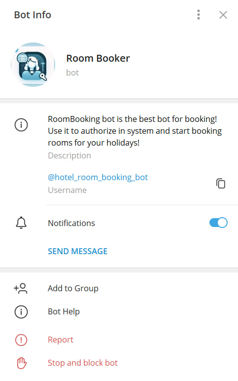

# Hotel Booking
---
The Hotel Booking System is a convenient application that allows users to easily and quickly book rooms in a hotel. With its help, you can find and book the perfect accommodation for your stay.

### Key features:

---
- View available rooms: users can easily find suitable rooms using filters and sorting by price and room's capacity.
- Search for vacant rooms: the system allows users to search for available rooms within a specified time interval.
- Room booking: book your desired room in just a few clicks. Booking is available only to registered users.
- Administrative panel: the superuser can manage rooms and bookings through the Django administrative panel.
- Registration and authentication: users can register to view their bookings and log in to the system to book rooms.


### Technological stack:

---
- Django.
- Django REST Framework:for API.
- PostgreSQL.
- Linters: _isort_ + _flake8_.

## Installation

---
All actions should be executed from the source directory of the project and only after installing all requirements.
1. Firstly, create and activate a new virtual environment:
   ```
   python3.9 -m venv ../venv
   source ../venv/bin/activate
   ```
2. Install packages:
   ```
   pip install --upgrade pip
   pip install -r requirements.txt
   ```
3. Run project dependencies, migrations, fill the database with the fixture data etc.:
   ```
   python manage.py migrate
   python manage.py loaddata <path_to_fixture_files>
   
   python manage.py bot
   python manage.py runserver 
   ```
   Run last 2 commands separately 

### Example of .env file

---
```text
DEBUG=bool
SECRET_KEY=django_secret_key

DATABASE_NAME=name
DATABASE_USER=user
DATABASE_PASSWORD=password
DATABASE_HOST=host
DATABASE_PORT=1234

BOT_TOKEN=bot_token
```

## As an interface you can use [bot](https://t.me/hotel_room_booking_bot)
> It might not be working because it's deployed and running locally)


